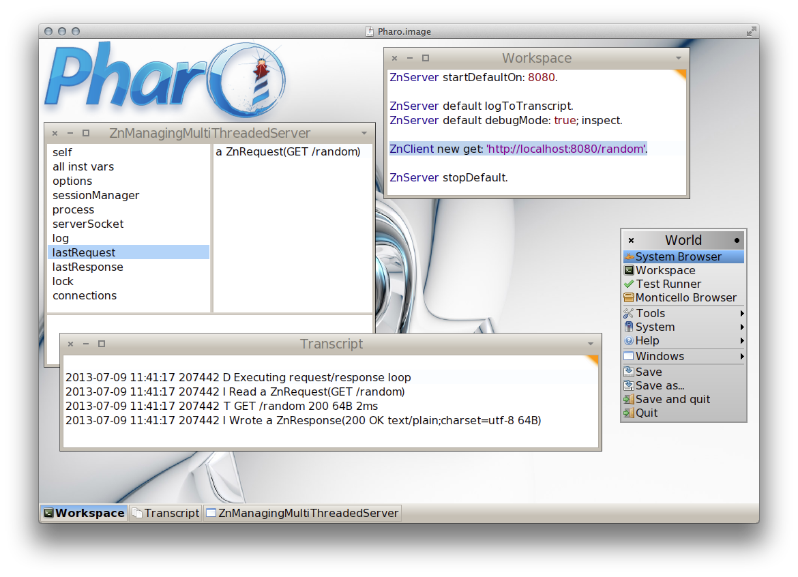
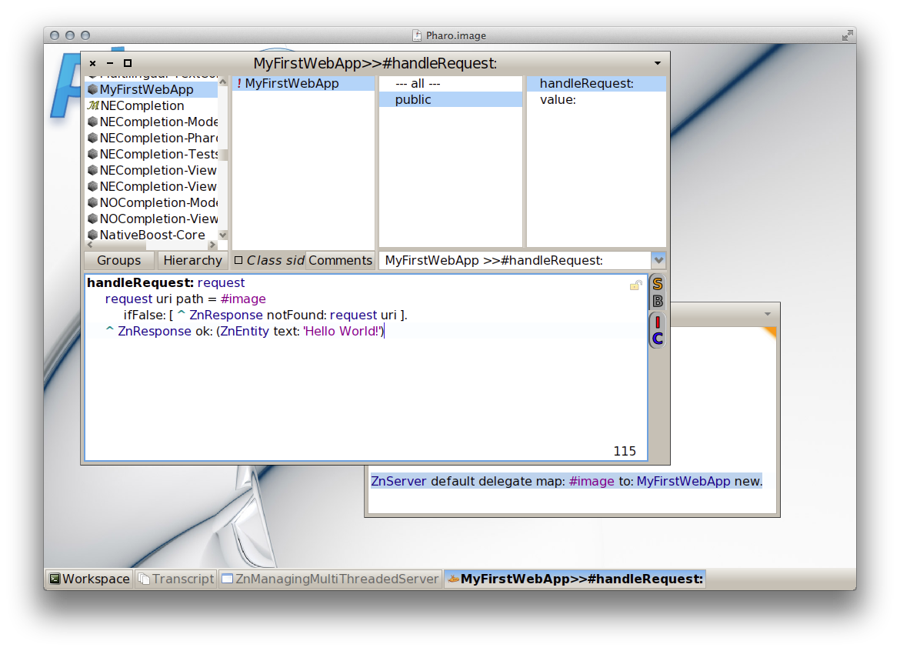
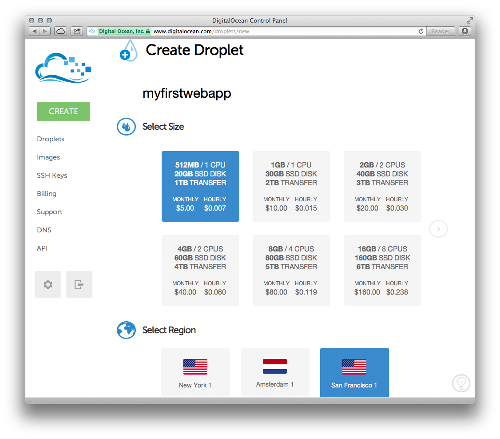

# Building and deploying your first web app with Pharo
### Understanding HTTP fundamentals through Zinc HTTP Components

*Sven Van Caekenberghe*

*July 2013*

There are lots of ways to get something on the Web today. However, it remains important that you understand the actual mechanics of building and deploying a web application. This guide explains how to build and deploy your first web application using [Pharo](http://www.pharo.org).

Of course, there are an infinite number of ways to make a web app. Even in Pharo, there are multiple frameworks approaching this problem, most notably [Seaside](http://www.seaside.st), [AIDAweb](http://www.aidaweb.si) and [Iliad](http://www.iliadproject.org). Here, we'll be using the foundational framework called [Zinc HTTP Components](http://zn.stfx.eu). By doing so, we'll be touching the fundamentals of HTTP and web apps.

Using nice objects, abstracting each concept in [HTTP](http://en.wikipedia.org/wiki/Http) and related open standards, the actual code will be easier than you might expect.

The dynamic, interactive nature of Pharo combined with its rich IDE and library will allow us to do things that are nearly impossible using other technology stacks. By chronologically following the development process, you will see the app growing from something trivial to the final result. Finally, we will save our source code in a repository and deploy for real in the cloud.

Let's get started.

## The web app

The web application that we are going to build will show a picture and allow users to change the picture by uploading a new one. Because we want to focus on the basic mechanics, the fundamentals as well as the build and deploy process, there are some simplifications. There will be one picture for all users, no login and we will store the picture in memory.

In our implementation, /image will serve an HTML page containing the image and a form. To serve the raw image itself, we'll add a parameter, like /image?raw=true. These will be GET HTTP requests. The form will submit its data to /image as a POST request.

## Downloading Pharo

Go to [http://www.pharo.org](http://www.pharo.org) and download the whole self-contained package for your platform, it is just 12 to 14 MB. Select the released version 2.0. Although not recommended for beginners, current development version 3.0 will do just fine as well. Double-click and you enter the Pharo world.

Pharo is an incredible sophisticated and deep environment and toolset. The [Pharo by Example](http://pharobyexample.org) book is probably the best way to get started if all this is totally new to you. In what follows we assume you at least read the first chapter, 'A Quick Tour of Pharo'.

## Running an HTTP server

Open a Workspace, type and execute

    ZnServer startDefaultOn: 8080. 

Now open the address [http://localhost:8080](http://localhost:8080) in your favourite browser. You should get the default welcome page of Zinc HTTP Components. If you visit [http://localhost:8080/help](http://localhost:8080/help) you will see a list of all available pages. Now add the following line to your workspace and execute it

    ZnServer default logToTranscript.

Next open the Transcript and visit or reload a page. You should see log output like this

    2013-07-07 00:22:49 479147 D Executing request/response loop
    2013-07-07 00:22:49 479147 I Read a ZnRequest(GET /)
    2013-07-07 00:22:49 479147 T GET / 200 977B 2ms
    2013-07-07 00:22:49 479147 I Wrote a ZnResponse(200 OK text/html;charset=utf-8 977B) 

You can see the server entering the request/response loop for a certain connection/thread. A request is read and a response is written. Let's have a look under the hood. Put the server in debug mode and inspect it like this

    ZnServer default debugMode: true; inspect.

Visit and reload a page. Now you can use the inspector to explore the actual lastRequest and lastResponse objects. Pretty cool, right ?

To complete our little tour, let's try one more thing. We can execute any request programmatically as well, using an HTTP client. To visit a page, try inspecting the result of

    ZnClient new get: 'http://localhost:8080/random'.

If you would look inside the client object, you would find similar request and response objects. Which makes total sense since the client talks to the server and vice versa, over the network. If you want, you can stop the server using

    ZnServer stopDefault.

If you are curious, please consult the [Zinc HTTP Components](http://zn.stfx.eu/zn/zinc-http-components-paper.html) documentation.

## Saying hello world

Let's lay the groundwork for our new web application by making a version that only says 'Hello World!'. We'll be extending the web app gradually until we reach our functional goal. 

Open the Nautilus System Browser and create a new package (right click in the first column) called something like **'MyFirstWebApp'**. Now create a new class (right click in the second column) with the same name, **MyFirstWebApp**. You will be given a template: edit 'NameOfSubclass' and accept by clicking 'OK'. Your definition should now appear in the bottom pane

    Object subclass: #MyFirstWebApp
      instanceVariableNames: ''
      classVariableNames: ''
      poolDictionaries: ''
      category: 'MyFirstWebApp'

Any object can be a web app, it only has to respond to a message called **#handleRequest:** to answer a response based on a request. Now add the following method

    handleRequest: request
      request uri path = #image
        ifFalse: [ ^ ZnResponse notFound: request uri ].
      ^ ZnResponse ok: (ZnEntity text: 'Hello World!')

Create a new protocol called 'public' (by right-clicking in the third column). When the new protocol is selected, a new method template will appear in the bottom pane. Overwrite the whole template with the code above and accept it.

What we do here is look at the incoming request to make sure the URI path is /image which will be the final name of our web app. If not, we return a Not Found (code 404) response. If so, we create and return an OK response (code 200) with a simple text entity as body or payload.

    value: request
      ^ self handleRequest: request

Now do the same for the **#value:** method, effectively making it an alias of #handleRequest: - this is needed so our web app object can be used more flexibly. To test our web app, we'll add it as one of the pages of the default server, like this

    ZnServer startDefaultOn: 8080.
    ZnServer default delegate map: #image to: MyFirstWebApp new.

The second expression adds a route from /image to an instance of our web app object. If all is well, [http://localhost:8080/image](http://localhost:8080/image) should show your friendly message. Note how we are not even serving HTML, just plain text. 

Try changing the text. Try putting a breakpoint in MyFirstWebApp>>#handleRequest: (right-click on the method name in the fourth column) and inspecting things. Then just continue the execution. Note how this is a live environment: you make a little change and it is immediately used, you can look into the actual request and response objects moving around.

 

Leave the server running. If you want you can enable logging again, or switch to debug mode and inspect the server instance. Don't forget to remove any breakpoints you set.

## Serving an HTML page

HTML generation and/or using templates can be done with some of the higher level frameworks, here we'll manually compose our HTML. Go ahead and add a new method, **#html**, while changing a previous one slightly

    html
      ^ '<html><head><title>Image</title>
      <body>
      <h1>Image</h1>
      </body></html>'
    
    handleRequest: request
      request uri path = #image
        ifFalse: [ ^ ZnResponse notFound: request uri ].
      ^ ZnResponse ok: (ZnEntity html: self html)

Accept the above two methods and test [http://localhost:8080/image](http://localhost:8080/image) again to make sure you now see a real HTML page.

You have a probably noted the red exclamation mark icon in front of our class name in the browser. This is an indication that we have no class comment, which is not good: documentation is important. Click the 'Comment' button and write some documentation. You can also use the class comment as a notepad for yourself, saving useful expressions that you can later execute in place. 

## Serving an image

Images for the purpose of our web app can be any of three types: GIF, JPEG or PNG. We will store them in memory as an entity, an object wrapping the actual bytes together with a mime type.

To simplify our app, we will arrange things so that we always start with a default image, then we always have something to show. Let's add a little helper, **#downloadPharoLogo** 

    downloadPharoLogo
      ^ ZnClient new 
          beOneShot;
          get: 'http://www.pharo-project.org/images/pharo.png';
          entity 

Quickly test the code by selecting the method body (not including the name) and inspecting the result. You should get an image entity back. Now add the accessor **#image**

    image
      ^ image ifNil: [ image := self downloadPharoLogo ]

When you try to accept this method, you will get an error. We are using an unknown variable, image. Select the option to automatically declare a new instance variable and we are good.

Remember that we decided we were going to serve the raw image itself using a query variable, like /image?raw=true. Make the following modification to existing methods and add a new one

    html
      ^ '<html><head><title>Image</title>
      <body>
      <h1>Image</h1>
      
      </body></html>'
    
    handleRequest: request
      request uri path = #image
        ifFalse: [ ^ ZnResponse notFound: request uri ].
      ^ self handleGetRequest: request
    
    handleGetRequest: request
      ^ (request uri queryAt: #raw ifAbsent: [ nil ])
          ifNil: [ ZnResponse ok: (ZnEntity html: self html) ]
          ifNotNil: [ ZnResponse ok: self image ]

We extended our HTML with a IMG element. We delegate some of our request handling to a new method, **#handleGetRequest:** where we inspect the incoming URI. If it has a non empty query variable raw we serve the raw image directly, else we serve the HTML page like before.

Check it out: you should now see an image in the browser when visiting [http://localhost:8080/image](http://localhost:8080/image) !

## Uploading a new image

Interaction is what differentiates a web site from a web application. We will now add the ability for users to upload a new image to change the one on the server. To add this ability we need to use an HTML form. Let's change our HTML one final time.

    html
      ^ '<html><head><title>Image</title>
      <body>
      <h1>Image</h1>
      
       
      <form enctype="multipart/form-data" action="image" method="POST">
       <h3>Change the image:</h3>
       <input type="file" name="file"/>
       <input type="submit" value= "Upload"/>
      </form>
      </body></html>'

The user will be able to select a file on the local disk for upload. When s/he click the Upload submit button, the web browser will send an HTTP POST to the action URL, /image, encoding the form contents using a technique called multi-part form-data. With the above change, you will be able to see the form, its just won't work, yet.

In our request handling, we have to distinguish between GET and POST requests. Change #handleRequest: to its final form.

    handleRequest: request
      request uri path = #image
        ifTrue: [ 
          request method = #GET
            ifTrue: [ ^ self handleGetRequest: request ].
          request method = #POST
            ifTrue: [ ^ self handlePostRequest: request ] ].
      ^ ZnResponse notFound: request uri

Now we have to add an implementation of **#handlePostRequest:** to accept the uploaded image and change the current one.

    handlePostRequest: request
      | part newImage |
      part := request entity partNamed: #file.
	    newImage := part entity.
      image := newImage.
      ^ ZnResponse redirect: #image

We start with a simple version without error handling. The entity of the incoming request is a multi-part form-data object containing named parts. Each part, such as the file part, contains another sub-entity. In our case, the uploaded image. Note also how the response to the POST is a redirect to our main page. You should now have a fully functional web app. Go and try it out!

We have taken a bit of a shortcut in the code above. It is pretty dangerous to just accept what is coming in from the internet without doing some checking. Here is a version that does that.

    handlePostRequest: request
      | part newImage badRequest |
      badRequest := [ ^ ZnResponse badRequest: request ].
      (request hasEntity 
          and: [ request contentType matches: ZnMimeType multiPartFormData ])
        ifFalse: badRequest.
      part := request entity 
                partNamed: #file
                ifNone: badRequest.
      newImage := part entity.
      (newImage notNil
          and: [ newImage contentType matches: 'image/*' asZnMimeType ])
        ifFalse: badRequest.
      image := newImage.
      ^ ZnResponse redirect: #image

Our standard response when something is wrong will be to return a Bad Request (code 400). We define this behaviour to a local variable so that we can reuse it multiple times over. The first test makes sure there actually is an entity in the POST request and that it is of the correct type. Next we handle the case when there is no file part. Finally, we make sure the file part is actually an image (JPEG, PNG or GIF) by matching with the wildcard image/* mime type.

If you are curious, set a breakpoint in the method and inspect the request object of an actual request. You can learn an awful lot from looking at live objects.

## Live debugging

Let's make a deliberate error in our code. Change #handlePostRequest: so that the last line reads like

      ^ ZnResponse redirectTo: #image

The compiler will already complain, ignore the warning and accept the code anyway. Try uploading a new image. The debugger will pop up telling you that ZnResponse does not understand #redirectTo: and show you the offending code. You could fix the code and try uploading again to see if it works.

But we can do better! Just fix the code and accept it. Now you can restart and proceed the execution. The same request is still active and the server will now do the correct thing. Have a look at your web browser: you will see that your initial action, the upload, that first initially hung, has now succeeded.

Up to now, the suggestion was that you can use the debugger and inspector tools to look at requests and responses. But you can actually change them while they are happening ! Prepare for our experiment by making sure that you change the image to be different from the default one. Now set a breakpoint in #handleGetRequest: and reload the main page. There will be two requests coming in: the first one for /image and the second one for /image?raw=true. Proceed the first one. 

Now, with the execution being stopped for the second request, click on the image instance variable in the bottom left pane. The pane next to it will show some image entity. Select the whole contents and replace it with

    self downloadPharoLogo

and accept the change. Now proceed the execution. Your previously uploaded image is gone, replaced again by the default Pharo logo. We just changed an object in the middle of the execution. 

Imagine doing all your development like that, having a real conversation with your application, while you are developing it. Be warned though: once you get used to this, it will be hard to go back.

## Image magic

The abilities to look at the requests and responses coming in and going out of the server, to set breakpoints, to debug live request without redoing the user interaction or to modify data structure live are already great and quite unique. But there is more.

Pharo is not just a platform for server applications, it can be used to build regular applications with normal graphics as well. In fact, it is very good at it. That is why it has built-in support to work with JPEG, GIF or PNG.

Would it not be cool to be able to actually parse the image that we were manipulating as an opaque collection of bytes up till now ? To make sure it is real. To look at it while debugging. Turns out this is quite easy. Are you ready for some [image magick](http://en.wikipedia.org/wiki/ImageMagick), pun intended ?

The Pharo object that represents images is called a form. There are objects called GIFReadWriter, PNGReadWriter and JPEGReadWriter that can parse bytes into forms. Add two helper methods, **#formForImageEntity:** and **#form**

    formForImageEntity: imageEntity
      | imageType parserClassName parserClass parser |
      imageType := imageEntity contentType sub.
      parserClassName := imageType asUppercase, #ReadWriter.
      parserClass := Smalltalk globals at: parserClassName asSymbol.
      parser := parserClass on: imageEntity readStream.
	    ^ parser nextImage
    
    form
      ^ self formForImageEntity: self image

What we do is use the sub type of the mime type, like png in image/png, to find the parser class. Then we instanciate a new parser on a read stream on the actual bytes and invoke the parser with sending #nextImage, which will return a form. The #form method makes it easy to invoke all this logic on our current image. 

Now we can have a look at, for example, the default image like this

    MyFirstWebApp new form asMorph openInWindow.

Obviously you can do this while debugging too. We can also use the image parsing logic to improve our error checking even further. Here is the final version of #handlePostRequest:

    handlePostRequest: request
      | part newImage badRequest |
      badRequest := [ ^ ZnResponse badRequest: request ].
      (request hasEntity 
          and: [ request contentType matches: ZnMimeType multiPartFormData ])
        ifFalse: badRequest.
      part := request entity 
                partNamed: #file
                ifNone: badRequest.
      newImage := part entity.
      (newImage notNil 
          and: [ newImage contentType matches: 'image/*' asZnMimeType ])
        ifFalse: badRequest.
      [ self formForImageEntity: newImage ]
        on: Error 
        do: badRequest.
      image := newImage.
      ^ ZnResponse redirect: #image

Before making the actual assignment of the new image to our instance variable we added an extra expression. We try parsing the image. We are not interested in the result, but we do want to reply with a bad request when the parsing should fail.

Once we have a form object, the possibilities are almost endless. You can query a form for the its size, depth and other elements. You can manipulate the form in various ways: scaling, resizing, rotating, flipping, cropping, compositing. And you can do all this in an interactive, dynamic environment.

## Adding tests

We all know that testing is good, but how do we actually test a web app ? Writing some basic tests is actually not difficult, since Zinc HTTP Components covers both the client and the server side with the same objects.

Writing tests is creating objects, letting them interact and then asserting a number of conditions. Create a new subclass of TestCase, **MyFirstWebAppTests**, and add the following helper method.

    withServerDo: block
      | server |
      server := ZnServer on: 1700 + 10 atRandom.
      [ 
        server start.
        self assert: server isRunning & server isListening.
        server delegate: MyFirstWebApp new.
        block cull: server
      ] 
        ensure: [ server stop ]

Since we will be needing a configured server instance with our web app as delegate for each of our tests, we move that logic into **#withServerDo:** and make sure the server is OK and properly stopped afterwards. Now we are ready for our first test.

    testMainPage
      self withServerDo: [ :server |
        | client |
        client := ZnClient new.
        client url: server localUrl; addPath: #image.
        client get.
        self assert: client isSuccess.
        self assert: (client entity contentType matches: ZnMimeType textHtml).
        self assert: (client contents includesSubstring: 'Image').
        client close ]

In #testMainPage we do a request for the main page, /image, and assert that the request is successful and contains HTML. Make sure the test is green by running it from the browser (click the round icon in front of the method name in the fourth pane).

Let's try to write a test for the actual raw image being served. 

    testDefaultImage
      self withServerDo: [ :server |
        | client |
        client := ZnClient new.
        client url: server localUrl; addPath: #image; queryAt: #raw put: #true.
        client get.
        self assert: client isSuccess.
        self assert: (client entity contentType matches: 'image/*' asZnMimeType).
        self assert: client entity equals: server delegate image.
        client close ]

Note how we can actually test for equality between the served image and the one inside our app object (the delegate). Run the test.

Our final test will actually do an image upload and check if the served image did actually change to what we uploaded.

    image
      ^ ZnClient new
          beOneShot;
          get: 'http://zn.stfx.eu/zn/Hot-Air-Balloon.gif';
          entity

    testUpload
      self withServerDo: [ :server |
        | image client |
        image := self image.
        client := ZnClient new.
        client url: server localUrl; addPath: #image.
        client addPart: (ZnMimePart fieldName: #file entity: image).
        client post.
        self assert: client isSuccess.
        client resetEntity; queryAt: #raw put: #true.
        client get.
        self assert: client isSuccess.
        self assert: client entity equals: image.
        client close ]

The HTTP client object is pretty powerful. It can do a correct multi-part form-data POST, just like a browser. Furthermore, once configured, it can be reused, like for the second GET request.

## Saving code to a repository

If all is well, you now have a package called MyFirstWebApp containing two classes, MyFirstWebApp and MyFirstWebAppTests. The first one should have 9 methods, the second 5. If you are unsure about your code, you can double check with the full listing at the end of this document. Our web app should now work as expected, and we have some tests to prove it.

But our code currently only lives in our development image. Let's change that and move our code to a source code repository. For this we first have to define a Monticello package. Click on the package name in the first column of the browser and select the option 'Create an MC package'. Use the same name.

Pharo uses distributed source code management. Your code can live on your local file system, or it can live on a server. The main place for storing Pharo code is on [SmalltalkHub](http://www.smalltalkhub.com). Go over there and create yourself a new account. Once you have an account, create and register a new project called **'MyFirstWebApp'**. You can leave the public option checked, it means that you and others can download the code without credentials. Go to the project's page.

On this page, select and copy the Monticello registration template (make sure to copy the whole contents, including the username and password parts). Now go back to Pharo and add a repository for your package (right-click on the package name, select Open… > Add a repository).

Select Smalltalkhub.com as repository type and overwrite the presented template with the one you just copied. It should look similar to 

    MCHttpRepository
      location: 'http://www.smalltalkhub.com/mc/SvenVanCaekenberghe/MyFirstWebApp/main'
      user: ''
      password: ''

Now before accepting, fill in your user(name) and password (between the single quotes), the ones you gave during registration on SmalltalkHub. Open the Monticello Browser to see what we have done. Find your package in the first column and your repository in the second one.

There should be a asterisk (*) in front of your package name, indicating that the package is dirty, that it has uncommitted changes. If not, force a change computation by clicking 'Changes' button. You should get a browser showing all the changes that you made. Since this is the first version, all your changes are additions.

OK, we're almost done. Go back to the Monticello Browser and click the 'Save' button (with your package and repository selected). Leave the version name, something like MyFirstWebApp-SvenVanCaekenberghe.1 alone, write a nice commit message in the second pane and press Accept to save your code to SmalltalkHub.

When all goes well, you will see an upload progress bar and finally a version window that confirms the commit. You can close it later on.

    Name: MyFirstWebApp-SvenVanCaekenberghe.1
    Author: SvenVanCaekenberghe
    Time: 9 July 2013, 2:18:24.638381 pm
    UUID: adad42a6-ff4c-41a4-a2a3-09f8cb29c902
    Ancestors: 

    First check in of our web app, following 'Building and deploying your first web app in Pharo'.

If something goes wrong, you probably made a typo in your repository specification. You can edit it by right-clicking on it in the Monticello Browser and selecting 'Edit repository info'. If a save fails, you will get a Version Window after some error message. Don't close the Version Window. Your code now lives in your local package cache. Click the 'Copy' button and select your SmalltalkHub repository to try saving again.

You can now browse back to [Smalltalkhub.com](Smalltalkhub.com) to confirm that your code arrived there.

After a successful commit, it is a good idea to save your image. In any case, your package should now no longer be dirty, and there should be no more differences between the local version and the one on SmalltalkHub.
 
## Defining a project configuration

Real software consists of several packages and will depend on extra external libraries and frameworks. In practice, software configuration management, including the management of dependencies and versions, is thus a necessity.

To solve this problem, Pharo is using Metacello. And although we don't really need it for our small example, we are going to use it anyway. Of course, we will not go into details as this is a complex subject.

To create a Metacello configuration, you define an object, what else did you expect ? First create a new package as well as a Metacello package called **'ConfigurationOfMyFirstWebApp'**. Then go find the class MetacelloConfigTemplate. You have to copy this class (right-click on the class name) and name it **'ConfigurationOfMyFirstWebApp'** as well. Now move the copy to your new package by dragging it, or by editing the category field of the class definition.

We are going to define three methods: one defining a baseline for our configuration, one defining concrete package versions for that baseline, and one declaring that version as the stable released version. Here is the code (if you would be working in Pharo 3.0 you will notice that MetacelloConfigTemplate contains some extra template methods, remove any baseline or version related ones and overwrite #stable:) 

    baseline1: spec
      <version: '1-baseline'>
      spec for: #common do: [
        spec 
          blessing: #baseline;
          repository: 'http://smalltalkhub.com/mc/SvenVanCaekenberghe/MyFirstWebApp/main/';
          package: 'MyFirstWebApp' ]

    version1: spec
      <version: '1' imports: #('1-baseline')>
      spec for: #common do: [
        spec
          blessing: #release;
          package: 'MyFirstWebApp' with: 'MyFirstWebApp-SvenVanCaekenberghe.1' ]

    stable: spec
      <symbolicVersion: #'stable'>
      spec for: #common version: '1'

You can test your configuration by trying to load it.

    ConfigurationOfMyFirstWebApp load.

Of course, not much will happen since you already have the specified version loaded. For some feedback, make sure the Transcript is open and inspect the above expression.

Now add your SmalltalkHub repository to the ConfigurationOfMyFirstWebApp Monticello package. Double-check the changes in the Monticello Browser, remember we copied a whole class. Now commit by saving to your SmalltalkHub repository. Use the web interface to verify that all went well.

## Running a real cloud server

So we created our first web app and tested it locally. We stored our source code in the SmalltalkHub repository and created a Metacello configuration for it. Now we need a real cloud server to run our web app.

It used to be hard and expensive to get access to a real server permanently connected to the internet. Not any more: prices have comes down and operating cloud servers has become a much easier to use service.

For this guide, we will be using [Digital Ocean](http://www.digitalocean.com). The entry level server there, which is more than powerful enough for our experiment, costs just $5 a month. If you stop and remove the server after a couple of days, you will only pay cents. Go ahead and make yourself an account and register a credit card.

A server instance is called a Droplet. Click the 'Create Droplet ' button and fill in the form. Pick a hostname, select the smallest size, pick a region close to you. As operating system image, we'll be using a 32-bit Ubuntu Linux, Ubuntu version 13.04 x32. You can optionally use an SSH key pair to log in, just skip this option if you are uncomfortable with this. Finally click the 'Create Droplet' button.

In less than a minute, your new server instance will be ready. Your root password will be emailed to you. If you look at your droplets, you should see your new server in the list. Click on it to see its details. 

The important step now is to get SSH command line access to your new server, preferably using a normal terminal. With the IP address from the control panel and the root password emailed to you, try to log in.

    $ ssh root@82.196.12.54

Your server is freshly installed and includes only the most essential core packages. Now we have to install Pharo on it. One easy way to do this is using the functionality offered by [http://get.pharo.org](http://get.pharo.org). The following command will install a fresh Pharo 2.0 image together with all other files needed.

    # curl get.pharo.org/20+vm | bash

Make sure the VM+image combination works by asking for the image version.

    # ./pharo Pharo.image printVersion
    [version] 2.0 #20611

Let's quickly test the stock HTTP server that comes with Pharo, like we did in the third section of this guide.

    # ./pharo Pharo.image eval --no-quit 'ZnServer startDefaultOn: 8080'

This command will block. Now access your new HTTP server at [http://82.196.12.54:8080](http://82.196.12.54:8080) after substituting your own IP address of course. You should see the Zinc HTTP Components welcome page. If this works, you can press ctrl-C in the terminal to end our test.

## Deploying for production

We now have a running server. It can run Pharo too, but it is currently using a generic image. How do we get our code deployed ? To do this we use the Metacello configuration. But first, we are going to make a copy of the stock Pharo.image that we downloaded. We want to keep the original clean while we make changes to the copy.

    # ./pharo Pharo.image save myfirstwebapp

We now have a new image (and changes) file called myfirstwebapp.image (and myfirstwebapp.changes). Through the config command line option we can load our Metacello configuration. Before actually loading anything, we will ask for all available versions to verify that we can access the repository.

    # ./pharo myfirstwebapp.image config http://www.smalltalkhub.com/mc/SvenVanCaekenberghe/MyFirstWebApp/main ConfigurationOfMyFirstWebApp
    ===============================================================================
    Notice: Available versions for ConfigurationOfMyFirstWebApp
    ===============================================================================
    1
    1-baseline
    bleedingEdge
    last
    stable

Since we have only one version, all the above are equivalent references to the same version. Now we will load and install the stable version.

    # ./pharo myfirstwebapp.image config http://www.smalltalkhub.com/mc/SvenVanCaekenberghe/MyFirstWebApp/main ConfigurationOfMyFirstWebApp --install=stable
    ===============================================================================
    Notice: Installing ConfigurationOfMyFirstWebApp stable
    ===============================================================================

After loading all necessary code, the config option will also save our image so that it now permanently includes our code. Although we could try to write a (long) one line expression to start our web app in a server and pass it to the eval option, it is better to write a small script. Create a file called 'run.st' with the following contents

    ZnServer defaultOn: 8080.
    ZnServer default logToStandardOutput.
    ZnServer default delegate 
      map: 'image' to: MyFirstWebApp new;
      map: 'redirect-to-image' to: [ :request | ZnResponse redirect: 'image' ];
      map: '/' to: 'redirect-to-image'. 
    ZnServer default start. 

We added a little twist here: we changed the default root (/) handler to redirect to our new /image web app. Test the startup script like this

    # ./pharo myfirstwebapp.image run.st
    2013-07-10 11:46:58 660707 I Starting ZnManagingMultiThreadedServer HTTP port 8080
    2013-07-10 11:46:58 670019 D Initializing server socket
    2013-07-10 11:47:12 909356 D Executing request/response loop
    2013-07-10 11:47:12 909356 I Read a ZnRequest(GET /)
    2013-07-10 11:47:12 909356 T GET / 302 16B 0ms
    2013-07-10 11:47:12 909356 I Wrote a ZnResponse(302 Found text/plain;charset=utf-8 16B)
    2013-07-10 11:47:12 909356 I Read a ZnRequest(GET /image)
    2013-07-10 11:47:12 909356 T GET /image 200 282B 0ms
    2013-07-10 11:47:12 909356 I Wrote a ZnResponse(200 OK text/html;charset=utf-8 282B)
    2013-07-10 11:47:12 909356 I Read a ZnRequest(GET /image?raw=true)
    2013-07-10 11:47:12 909356 T GET /image?raw=true 200 18778B 82ms
    2013-07-10 11:47:12 909356 I Wrote a ZnResponse(200 OK image/png 18778B)

Surf to the correct IP address and port to test you application. Note that /welcome, /help and /image are still available too. Type ctrl-c to kill the server again. Now it is time to put the server in background, running for real.

    # nohup ./pharo myfirstwebapp.image run.st &

## One more step

Did you like the example so far ? Would you like to take one more step ? Here is a little extension, as an exercise.

Add an extra section at the bottom of the main page that shows a miniature version of the previous image. Initially, you can show an empty image. Here are a couple of hints. Read only as far as you need, try to figure it out yourself.

### Hint 1

You can scale a form object into another one using just one message taking a single argument. You can use the same classes that we used for parsing as a tool to generate PNG, JPEG or GIF images given a form.

When you are done, save your code as a new version. Then update your configuration with a new, stable version. Finally, go to the server, update your image based on the configuration and restart the running vm+image.

### Hint 2

Change the #html method referring to a new variant, /image?previous=true, for the second image. Adjust #handleGetRequest: to look for that attribute.

Add a helper method #pngImageEntityForForm: and a #previousImage accessor. It is easy to create an empty, blank form as default. Call a #updatePreviousImage at the right spot in #handlePostRequest: and implement the necessary functionality there.

### Hint 3

If you found it difficult to find the right methods, have a look at the following ones:

- Form>>#scaledIntoFormOfSize:
- Form class>>#extent:depth:
- PNGReadWriter>>#nextPutImage:
- ByteArray class>>#streamContents:
- ZnByteArrayEntity class>>#with:type:

### Solution, part 1, new methods

Here are 3 new methods that are part of the solution.

    pngImageEntityForForm: form
      ^ ZnByteArrayEntity
          with: (ByteArray streamContents: [ :out |
                   (PNGReadWriter on: out) nextPutImage: form ])
          type: ZnMimeType imagePng

    previousImage
      ^ previousImage ifNil: [ 
          | emptyForm |
          emptyForm:= Form extent: 128 @ 128 depth: 8.
          previousImage := self pngImageEntityForForm: emptyForm ]

    updatePreviousImage
      | form scaled |
      form := self form.
      scaled := form scaledIntoFormOfSize: 128.
      previousImage := self pngImageEntityForForm: scaled

### Solution, part 2, changed methods

Here are the changes to 3 existing methods for the complete solution.

    html
      ^ '<html><head><title>Image</title>
      <body>
      <h1>Image</h1>
      
       
      <form enctype="multipart/form-data" action="image" method="POST">
       <h3>Change the image:</h3>
       <input type="file" name="file"/>
       <input type="submit" value= "Upload"/>
      </form>
      <h3>Previous Image</h3>
      
      </body></html>'

    handleGetRequest: request
      (request uri queryAt: #raw ifAbsent: [ nil ])
        ifNotNil: [ ^ ZnResponse ok: self image ].
      (request uri queryAt: #previous ifAbsent: [ nil ])
        ifNotNil: [ ^ ZnResponse ok: self previousImage ].
      ^ ZnResponse ok: (ZnEntity html: self html)

    handlePostRequest: request
      | part newImage badRequest |
      badRequest := [ ^ ZnResponse badRequest: request ].
      (request hasEntity 
          and: [ request contentType matches: ZnMimeType multiPartFormData ])
        ifFalse: badRequest.
      part := request entity 
                partNamed: #file
                ifNone: badRequest.
      newImage := part entity.
      (newImage notNil 
          and: [ newImage contentType matches: 'image/*' asZnMimeType ])
        ifFalse: badRequest.
      [ self formForImageEntity: newImage ]
        on: Error 
        do: badRequest.
      self updatePreviousImage.
      image := newImage.
      ^ ZnResponse redirect: #image

### Solution, part 3, updated configuration

To update our configuration, add 1 method and change 1 method.

    version2: spec
      <version: '2' imports: #('1-baseline')>
      spec for: #common do: [
        spec
          blessing: #release;
          package: 'MyFirstWebApp' with: 'MyFirstWebApp-SvenVanCaekenberghe.2' ]

    stable: spec
      <symbolicVersion: #'stable'>
      spec for: #common version: '2'

Of course, you will have to substitute your name for the concrete version.

## Conclusion

Congratulations: you have now built and deployed your first web app with Pharo. Hopefully you are interested in learning more. From [the Pharo website](http://www.pharo.org) you should be able to find all the information you need. Don't forget about the [Pharo by Example](http://pharobyexample.org) book and the mailing lists.

This guide was an introduction to writing web applications using Pharo, touching on the fundamentals of HTTP. Like we mentioned in the introduction, there are a couple of high level frameworks that offer more extensive support for writing web applications. The three most important ones are [Seaside](http://www.seaside.st), [AIDAweb](http://www.aidaweb.si) and [Iliad](http://www.iliadproject.org).

## Listing

Here is the full code listing of the web app. You can also find the code, including the tests and the Metacello configuration, checked in to SmalltalkHub in my [MyFirstWebApp](http://www.smalltalkhub.com/#!/~SvenVanCaekenberghe/MyFirstWebApp) project. A similar example is also included in Zinc HTTP Components itself, under the name ZnImageExampleDelegate[Tests].

    Object subclass: #MyFirstWebApp
      instanceVariableNames: ''
      classVariableNames: ''
      poolDictionaries: ''
      category: 'MyFirstWebApp'

    handleRequest: request
      request uri path = #image
        ifTrue: [ 
          request method = #GET
            ifTrue: [ ^ self handleGetRequest: request ].
          request method = #POST
            ifTrue: [ ^ self handlePostRequest: request ] ].
      ^ ZnResponse notFound: request uri

    value: request
      ^ self handleRequest: request

    handleGetRequest: request
      ^ (request uri queryAt: #raw ifAbsent: [ nil ])
          ifNil: [ ZnResponse ok: (ZnEntity html: self html) ]
          ifNotNil: [ ZnResponse ok: self image ]

    handlePostRequest: request
      | part newImage badRequest |
      badRequest := [ ^ ZnResponse badRequest: request ].
      (request hasEntity 
          and: [ request contentType matches: ZnMimeType multiPartFormData ])
        ifFalse: badRequest.
      part := request entity 
                partNamed: #file
                ifNone: badRequest.
      newImage := part entity.
      (newImage notNil 
          and: [ newImage contentType matches: 'image/*' asZnMimeType ])
        ifFalse: badRequest.
      [ self formForImageEntity: newImage ]
        on: Error 
        do: badRequest.
      image := newImage.
      ^ ZnResponse redirect: #image

    html
      ^ '<html><head><title>Image</title>
      <body>
      <h1>Image</h1>
      
       
      <form enctype="multipart/form-data" action="image" method="POST">
       <h3>Change the image:</h3>
       <input type="file" name="file"/>
       <input type="submit" value= "Upload"/>
      </form>
      </body></html>'

    downloadPharoLogo
      ^ ZnClient new 
          beOneShot;
          get: 'http://www.pharo-project.org/images/pharo.png';
          entity 

    image
      ^ image ifNil: [ image := self downloadPharoLogo ]

    formForImageEntity: imageEntity
      | imageType parserClassName parserClass parser |
      imageType := imageEntity contentType sub.
      parserClassName := imageType asUppercase, #ReadWriter.
      parserClass := Smalltalk globals at: parserClassName asSymbol.
      parser := parserClass on: imageEntity readStream.
	    ^ parser nextImage
    
    form
      ^ self formForImageEntity: self image
