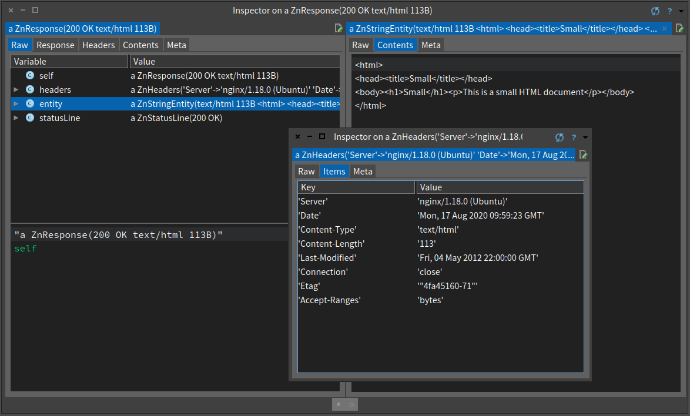
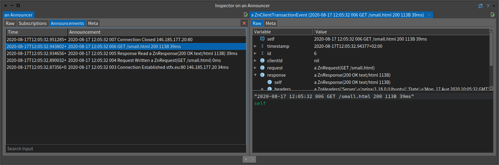

# Zinc HTTP Components in Pharo Smalltalk
## Examples of real world object design

## Forty years of Smalltalk

Sven Van Caekenberghe - August 2020

*first draft 2020-08-14 not yet published*

HTTP is one of the most important underlying technologies of the internet. Any modern system needs a good implementation of HTTP. But a Smalltalk system requires more than that: its implementation of HTTP should be written in itself so that it can be fully understood by its users.

Zinc HTTP Components is a fundamental part of Pharo Smalltalk providing an implementation of the HTTP protocol including a high level client and server. It is used as the foundation for many applications, including those consuming or offering Web Services and those built with the Seaside Web Application Framework.

This article shows a number of cases of real world object design from the Zinc HTTP Components framework.  

## Modelling the protocol

HTTP consists of requests sent from a client to a server and responses being sent back, over a network. Requests and responses are quite similar: they both contain headers (a collection of key value meta data) and an optional entity (the resource being transferred, like an HTML or text document). They differ in their very first line: requests start with a request line while responses start with a status line.

From a structural standpoint, our design naturally follows from the specification. We create a message superclass with request and response being subclasses. A headers class encapsulates dealing with the key value meta data, while both request and status line classes represent the first lines. A set of entity subclasses implements the optional entity/resource part.

From a behaviour standpoint, the protocol tells us what our message objects should be able to do. On the client side, it should be easy and elegant to create and configure a request object. Next it should be possible to write this composite object to a network stream. On the server side, the request object is read from a network stream and reconstructed into the same structure. For the response, a similar path is executed on the server side.

This leads us to define 2 key messages: readFrom: and writeTo: which all our HTTP objects should implement. In a composite request object for example, #writeTo: is implemented by delegating to its request line, headers and optional entity sub-objects.

Using carefully selected accessors and class side object creation methods, we build an API to elegantly deal with HTTP. Let's look at some code. Here is a script that executes a client side GET request according to the protocol specification.

    | url request response connection |
    url := 'http://stfx.eu/small.html' asUrl.
    request := ZnRequest get: url.
    request setConnectionClose.
    connection := ZnNetworkingUtils socketStreamToUrl: url.
    request writeOn: connection.
    connection flush.
    response := ZnResponse readFrom: connection.
    connection close.
    response.

First we define a URL object. Second we use this URL to create a request object. The get: instance creation method does everything to configure this composite object for this common case. Just as an example, we send setConnectionClose to the request to indicate that this will be a one shot request/response cycle - this sets the Connection header equal to Close.

Next we open a network connection (TCP socket stream) to the host part of the URL. We are now ready to send off our request by writing it on the wire. Finally we flush the stream to make sure the data is fully transferred.

If all goes well, we can now use the connection to read the response from the server.

In the above script, you can inspect any of the objects involved to figure out what they represent. The standard print representations of the request and response are already helpful.

    a ZnRequest(GET /small.html)
    a ZnResponse(200 OK text/html 113B)

For debugging purposes, we can also have a look at what went over the wire by writing the request and response to the Transcript.

    request writeOn: Transcript.
    response writeOn: Transcript.
    Transcript flush.

Which results in the following output. First comes the request.

    GET /small.html HTTP/1.1
    User-Agent: Zinc HTTP Components 1.0 (Pharo/7.0)
    Accept: */*
    Host: stfx.eu
    Connection: close

The first line is the request line, the other 4 lines constitute the header, there is no entity. Next the response is shown.

    HTTP/1.1 200 OK
    Server: nginx/1.18.0 (Ubuntu)
    Date: Thu, 13 Aug 2020 09:29:56 GMT
    Content-Type: text/html
    Content-Length: 113
    Last-Modified: Fri, 04 May 2012 22:00:00 GMT
    Connection: close
    Etag: "4fa45160-71"
    Accept-Ranges: bytes

    <html>
    <head><title>Small</title></head>
    <body><h1>Small</h1>
This is a small HTML document
</body>
    </html>

Here, the first line is the status line, then come 8 headers, an empty line and the entity, an HTML document. 

On the server side, something similar happens: the request is read, a response object is constructed and written. Here is an example of how such a response could be constructed.

    | page |
    page := ZnHtmlOutputStream streamContents: [ :html |
   	  html page: #Small do: [ 
        html tag: #p with: 'This is a small HTML document' ] ].
    ZnResponse ok: (ZnEntity html: page)

This should give you a first idea about what is going on inside Zinc HTTP Components and what an object based approach to HTTP looks and feels like.

The high level approach is to use an HTTP Client object which has a builder style API: you construct and configure your request before executing it, with the result stored inside the client.

    ZnClient new
      url: 'http://stfx.eu/small.html';
      beOneShot;
      systemPolicy;
      accept: ZnMimeType textHtml; 
      get.

The beOneShot message tells the client to act like we did earlier, to run only a single request/response cycle. The accept: message specifies the (mime) type of resource (entity) that we want. The systemPolicy message instructs the client to enforce both HTTP success and a matching mime type or else signal an error. The result of the get message is the actual contents of the resource, in this case the HTML as a String. If necessary, the full response object remains available inside the client object.

BTW, the absolute shortest way to retrieve the contents of a URL is to simply ask for it.

    'http://stfx.eu/small.html' asUrl retrieveContents.

## Custom streams

In a true dynamically typed language, the actual type (class) of an object is not the most important aspect. Instead, the messages understood by an object are what matters most.

There is a lot of stream based input and output happening in Zinc HTTP Components. The code doing this IO sticks to a small set of messages that these streams need to understand. We can replace one stream with another, even when they don't share a common superclass, as long as they implement (understand) the same messages.

Consider HTTP chunked transfer encoding. This is an optional technique whereby the server decides not to return a document in one push, but instead splits it in smaller parts, each part being preceded by its size until an empty chunk ends the stream. This is most often done with dynamically generated content where the total size is not known upfront.

When a client reads a response, the fact that chunked transfer is used is indicated in a header. A helper object, called the entity reader looks at the headers, sets up the proper stream and instructs the response object to read itself.

Unknown to the response's readFrom: code, the stream is changed. In case of chunked transfer, the original stream is wrapped in a ChunkedReadStream object that transparently deals with chunk processing.

The standard next or atEnd messages work as before, but ChunkedReadStream retrieves chunks of specific sizes from its wrapped stream, buffering as necessary. 

    ZnChunkedReadStream>>#next
      self ensureChunkOrAtEnd.
      self atEnd ifTrue: [ ^ nil ].
      ^ chunk at: (position := position + 1)  

Along the same pattern, there are streams that add buffering to unbuffered wrapped streams, that decode bytes into characters using a specific encoding, convert line ends, etc.

This composition or wrapping can happen multiple times: a character decoding stream could convert bytes to characters from a GZIP decoding stream from a chunked transfer stream from a TLS/SSL stream on a primitive socket stream. So data goes from encrypted to decrypted to being un-chunked to being decompressed and finally being character decoded.

All this happens transparently and without the need to share a common superclass, just by implementing the same set of required messages each time.

The advantage is that each functionality, interpreting chunked transfer, GZIP decompression, character decoding, buffering, is encapsulated in one single object and that you can combine them as needed.

## Support objects

One way to start a new object design is to build up domain specific language using support objects. These objects are often easier to define and implement. By encapsulating bits and pieces of specific functionality they are very useful nonetheless. In the domain of HTTP and internet protocols, there are many such objects. 

Being able to parse and interpret the constituent parts of a URL, generating a correctly encoded URL constructed from parts, fits nicely with a single object. Convenience API makes working with URL objects easier. Important behaviour like the construction of a new URL from a relative URL in the context of an existing URL finds its natural place here.

Once parsed, most easily done by sending asUrl to a String, the URL objects knows all details.

    'http://www.google.com/search?q=Smalltalk' asUrl queryAt: #q.
      "=> 'Smalltalk'"
    
    'http://www.google.com/search?q=42' asUrl authorityWithPort.
      "=> 'www.google.com:80'"
    
    'http://www.google.com/search?q=42' asUrl firstPathSegment.
      "=> 'search'"

The withRelativeReference: message implements a pretty tricky algorithm.
    
    'http://www.site.com/static/html/home.html' asZnUrl withRelativeReference: '../js/menu.js'.
      "=> http://www.site.com/static/js/menu.js"

Both of the following expressions generate the same URL, https://encrypted.google.com/search?q=Smalltalk%20en%20Fran%C3%A7ais. Note the encoding. First a builder style API is used, next convenience binary messages are used.
    
    ZnUrl new 
      scheme: #https; 
      host: 'encrypted.google.com'; 
      addPathSegment: 'search'; 
      queryAt: #q put: 'Smalltalk en Français'; 
      yourself.

    'https://encrypted.google.com' asUrl / #search ? (#q -> 'Smalltalk en Français'). 

Similar objects are MimeType, Cookie or CookieJar.

Another category of support objects implement algorithms. Examples are CharacterEncoder, BasicAuthenticator, PercentEncoder or Base64Encoder. Placing just the code of one algorithm in a single class can make a lot of sense due to the single responsibility principle. This does not prevent adding a number of convenience methods here and there to better integrate with standard classes.

For example, Base64 encoding a 10 element ByteArray with values 0 to 9 is equal to the String 'AAECAwQFBgcICQ=='.

    ZnBase64Encoder new encode: #[ 0 1 2 3 4 5 6 7 8 9 ].
    #[ 0 1 2 3 4 5 6 7 8 9 ] base64Encoded.

    ZnBase64Encoder new decode: 'AAECAwQFBgcICQ=='.
    'AAECAwQFBgcICQ==' base64Decoded.
   
The unary convenience message does the job in most cases. However, the actual support object has more options: changing the alphabet used, if and how to break lines, what newline character to use, how to do padding, what padding character to use, how strict to be while parsing. These options cannot all be expresses as arguments without increasing complexity again.

## Object logging

During development as well as during production, logging and metrics can be an important tool. In most cases, this is done by writing textual messages to log streams. Interpreting these streams is often very hard. Reimplementing classic logging frameworks does not solve the core issues.

Object logging is an elegant, powerful as well as efficient solution. The idea is simple: we instrument our code so that it generates actual log objects during its execution. This stream of log objects can then be used for inspection purposes during development as well as for classic textual logging, system monitoring and metrics calculations.

The design is just as simple. We create a hierarchy of custom log objects below the common superclass LogEvent, itself a subclass of Announcement. To distribute event objects we use an Announcer. This system class delivers Announcements to its subscribers, if any, possibly filtered by type. 

In Pharo you can inspect the following expression to get started.

    ZnLogEvent announcer.
    
In one of the inspector tabs you will see LogEvents arrive while Zinc HTTP Components executes client or server side code. 

LogEvents are created, filled with useful data, and then emitted.

    ZnLogEvent>>#emit
      self announcer announce: self 

Since we already create many objects during execution anyway, like requests, responses, URLs, etc, which are normally not used afterwards, packaging them in an event is cheap. What happens to these events is decided later by the code subscribing to them.

By implementing proper printOn: methods on each event, we can establish a regular way to print them, covering the classic textual logging case. The following expression sets up a listener for our log events and prints them to the Transcript.

    ZnLogEvent logToTranscript.
    
Executing a simple HTTP GET request will result in the following output.

    ZnClient new beOneShot get: 'http://stfx.eu/small.html'.

    2020-08-14 14:04:00 022 Connection Established stfx.eu:80 146.185.177.20 121ms 
    2020-08-14 14:04:00 023 Request Written a ZnRequest(GET /small.html) 0ms
    2020-08-14 14:04:00 024 Response Read a ZnResponse(200 OK text/html 113B) 29ms
    2020-08-14 14:04:00 025 GET /small.html 200 113B 29ms
    2020-08-14 14:04:00 026 Connection Closed 146.185.177.20:80

At the standard log level of the HTTP Client, 5 log events where generated: a ConnectionEstablishedEvent, a RequestWrittenEvent, a ResponseReadEvent, a ClientTransactionEvent and finally a ClientConnectionClosedEvent. As you can see, timing information is also included.

To monitor throughput on a server, we could subscribe to ServerTransactionEvents and count them. Since we also have access to the request and response of each transaction, we can compute the amount of bytes transferred. With access to the URL and all headers, we could add all kinds of extra filters.

Generating output in the industry standard Apache Common Log Format is just a question of using the proper formatter.

    | formatter |
    formatter := ZnCommonLogFormat new.
    ZnLogEvent announcer 
      when: ZnServerTransactionEvent 
      do: [ :event | 
        formatter format: event on: Transcript.
        Transcript cr; endEntry ]. 

Here the formatter finds all the data it needs in the event's embedded request and response.

## Closing

Smalltalk's simple language and object model, just messaging with minimal syntax constructs and single inheritance, form a surprisingly powerful tool to fully exploit object design in its purest form.

I hope this article piqued your interest enough to download Pharo Smalltalk and start exploring for yourself. There is much to learn.

## Author Bio

Sven Van Caekenberghe loves software development for cloud and web based systems using high-level, dynamic and interactive environments such as Smalltalk and Lisp. He is the founder and co-owner of Beta Nine, a software engineering company in Hasselt, Belgium. He is a proud supporter of the Pharo Association and Consortium as well as a member of the Board. He actively develops and maintains several key open source libraries for Pharo.
